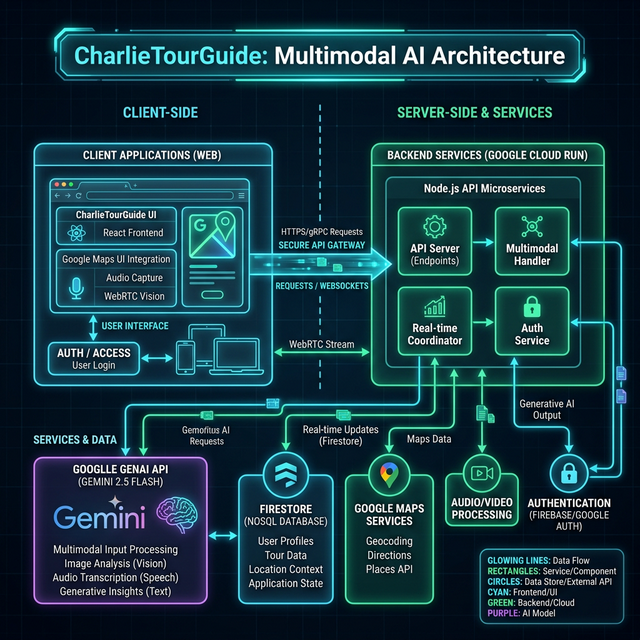
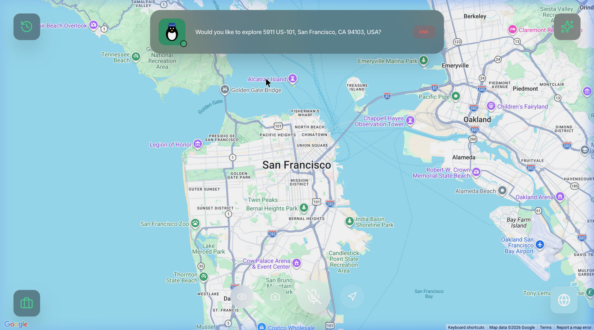
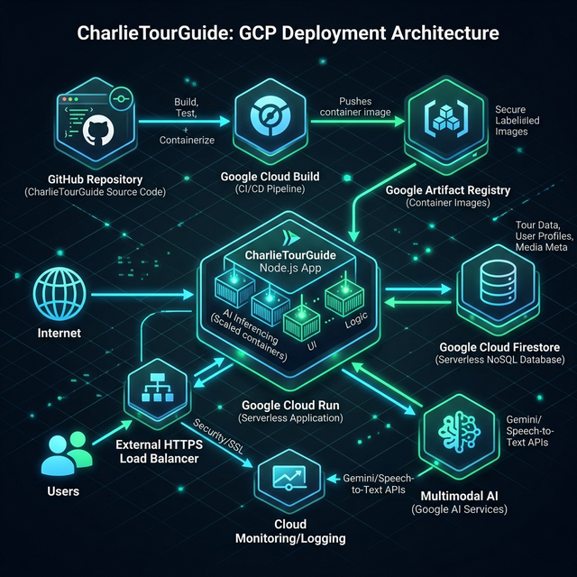
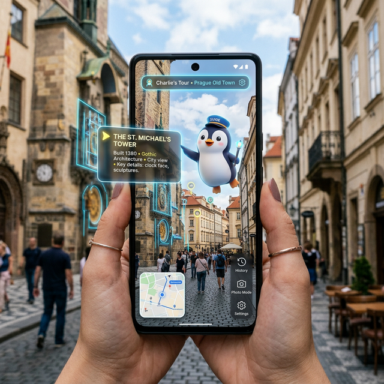

<div align="center">
  
  <h1>🐧 CharlieTourGuide: Your Autonomous Multimodal AI Companion</h1>
  <p><i>The Future of Conversational, Immersive Travel powered by Gemini 2.5 Flash Native Audio Preview.</i></p>
</div>

<br />

## 📖 Table of Contents
- [The Problem Statement](#-the-problem-statement)
- [The Solution & Impact](#-the-solution--impact)
- [How to Run (For Judges)](#-how-to-run-for-judges)
- [Deep Dive: Features & Capabilities](#-deep-dive-features--capabilities)
- [Architecture & How It Works](#-architecture--how-it-works)
- [Google Cloud Deployment Flow](#-google-cloud-deployment-flow)
- [Challenges & Accomplishments](#-challenges--accomplishments)
- [What's Next](#-whats-next)

---

## 🚨 The Problem Statement
A truly great tour guide can completely change your perspective on a city, bringing history and culture to life in ways you could never achieve on your own. However, world-class personal tour guides are:
- **Prohibitively Expensive:** Often costing hundreds of dollars for just a few hours.
- **Inflexible:** Locked into fixed schedules and pre-determined routes that don't bend to a traveler's spontaneous curiosity.
- **Language Limited:** Restricted by the languages spoken by human guides in any given locality. 

Conversely, the tech alternatives—like pre-recorded audio tours or generic mobile travel apps—are incredibly static. They talk *at* you, not *with* you, and they certainly cannot "see" what you are pointing your camera at or dynamically adapt their narrative based on your boredom or excitement.

## 🌟 The Solution & Impact
We built **CharlieTourGuide** to democratize and revolutionize the travel experience. Charlie is a fully autonomous, voice-first multimodal AI companion.

**The Impact:** Charlie makes premium, engaging, and context-aware travel guidance accessible to anyone with an internet connection. He doesn’t just read Wikipedia pages; he looks at the screen alongside you, uses deep multimodal AI to analyze the specific landmarks in front of you, draws real-time routes, highlights architectural details using dynamic UI elements, and builds comprehensive travel itineraries—all orchestrated through natural, interruption-friendly voice conversations.

---

## 🚀 How to Run (For Judges)

We've made spinning up Charlie exceptionally easy, with two distinct ways to review our work:

### 1. The Deployed Version (Recommended)
You can directly test the final deployed application built specifically for this hackathon on Google Cloud Run:
**Live URL:** [https://charlie-521515342281.us-central1.run.app](https://charlie-521515342281.us-central1.run.app)
*(Note: Please allow microphone access to talk to Charlie! Start by clicking the "Start" button.)*

### 2. Running Locally from GitHub
If you want to view the source code and run the application locally on your machine, follow these simple steps:

1. **Clone the repository:**
   ```bash
   git clone https://github.com/SVstudent/Gemini_Live_CharlieTourGuide.git
   cd Gemini_Live_CharlieTourGuide
   ```

2. **Install dependencies:**
   ```bash
   npm install
   ```

3. **Set up environment variables:**
   Since this app heavily relies on deeply-integrated Gemini capabilities, you need an API key. 
   ```bash
   cp .env.example .env
   ```
   *Edit `.env` and fill in your `GEMINI_API_KEY` and `VITE_GOOGLE_MAPS_API_KEY` (ensure you have the Maps JS, Directions, and Geocoding APIs enabled).*

4. **Start the local React & Express server:**
   ```bash
   npm run dev
   ```
   *Navigate to `http://localhost:8080` in your browser.*

---

## 🧭 Deep Dive: Features & Capabilities

Charlie leverages an extensive, finely tuned suite of "tools" (function declarations) injected directly into his Gemini System Prompt. This gives him absolute, autonomous control over the user experience.

- **`start_themed_tour(theme, city)`**: Generates cohesive, multi-stop routes (e.g., "Art Deco Chicago," "Hidden Alleys of Tokyo").
- **`update_map(lat, lng, zoom, tilt, heading)`**: Charlie physically drives the camera, swooping in and out of locations cinematically without the user touching their mouse.
- **`highlight_on_screen(x, y, label, type)`**: **Multimodal Vision in Action.** Charlie consumes the visual feed, identifies objects on the screen (like a specific gargoyle on a cathedral), and overlays bounding boxes or arrows exactly on those coordinates while talking about them.
- **`move_street_view()` & `toggle_street_view()`**: Plunges the user to ground level, pulling real-world imagery and letting Charlie walk you down the street organically while pointing out shopfronts and historical markers.
- **`create_travel_itinerary()`**: A massive, complex JSON-generation tool. If you ask Charlie how you can *actually* visit these places, he builds a highly realistic, day-by-day travel itinerary complete with flight estimates, hotel booking placeholder links, budget breakdowns, and emergency contacts.
- **Barge-In Capable:** Powered by the GenAI Live API, you can interrupt Charlie mid-sentence if you get bored or see something more interesting.

---

## 🏗 Architecture & How It Works

To deliver a latency-free, cinematic tour experience, we orchestrated a robust multimodal architecture separating mapping logistics from real-time AI streams.



### Technical Stack
- **Frontend (React, TypeScript, Tailwind):** We used the official `@vis.gl/react-google-maps` to achieve native rendering and deep control over the map's tilt, heading, and 3D terrain settings. Framer Motion drives the fluid UI animations.
- **Multimodal AI (Google GenAI SDK):** We deeply integrated the `@google/genai` Live API over WebSockets for full-duplex voice. By streaming base64 JPEGs of the UI elements to the model alongside the microphone data at a rapid framerate, we gave Charlie "eyes." 
- **Tool-Calling Engine:** The Gemini model autonomously strings together JSON-defined function calls (`update_map`, `highlight_on_screen`, etc.) to drive the UI state perfectly in sync with its audio responses.



---

## ☁️ Google Cloud Deployment Flow

For scalability, ultimate security, and hackathon readiness, we implemented a full Google Cloud deployment pipeline.



Instead of hardcoding API keys in our frontend (a major security risk), our frontend is served by a stateless **Node.js / Express Backend**, wrapped tightly inside a Docker container.

1. **Google Cloud Run:** We deployed our containerized application to Google Cloud Run natively. It scales gracefully and serves our app over HTTPS securely.
2. **Runtime Configuration Endpoint:** Upon initial load, the React frontend securely fetches the `GEMINI_API_KEY` and Google Maps credentials directly from an internal `/api/config` REST endpoint on the Node server, keeping the keys safe inside Google Secret Manager / Cloud Run Runtime variables.
3. **Cloud Firestore:** All of the user's historical saved locations, favorite tourist stops, and custom generated itineraries are synced and persisted seamlessly to a serverless Firestore NoSQL database instance.

---

## 🤺 Challenges & Accomplishments

### Challenges we ran into
- **Autonomy vs. User Control:** Finding the right balance where the AI can commandeer the map's camera state (zoom, street view POV, tilt) without aggressively fighting the user's manual dragging/interactions required precise state management and debounce logic.
- **The "Vision to Screen" Grounding Problem:** Creating a reliable coordinate system where Charlie could use his visual processing to output an `(x, y)` coordinate that actually landed precisely on the correct building in the React UI layout.
- **State Race Conditions:** Handling continuous, rapid-fire tool calls from Gemini Live over the WebSocket. We had bugs where Charlie drawing a multi-stop tour route was immediately overwritten by his next tool call to zoom the camera.

### Accomplishments that we're proud of
- **True Empathy & Charisma:** We successfully tuned the system instructions so that Charlie acts as a genuine leader—he proactively guides the user with a confident personality. He feels like a friend you're traveling with.
- **Flawless Multi-Agent Orchestration:** Integrating real-time web audio chunking, video frame extraction, and complex map manipulation into a unified, crash-free interface.
- **Our Cloud-Native Migration:** Moving successfully to Cloud Run & Firestore, eliminating all SQLite / local file dependencies and ensuring our API credentials stayed private while still working correctly on a deployed web build.

---

## 🔮 What's Next
- **True Mobile Augmented Reality (AR):** Integrating Charlie directly into smartphones so he can process your real-world camera feed while you walk down an actual street, projecting historical facts via AR overlays onto real life buildings.
- **Multiplayer Synchronized Tours:** Allowing friends in different cities to jump into the same shared map state, experiencing Charlie's narration together simultaneously while seeing each other's pointers.

<div align="center">
  
</div>
