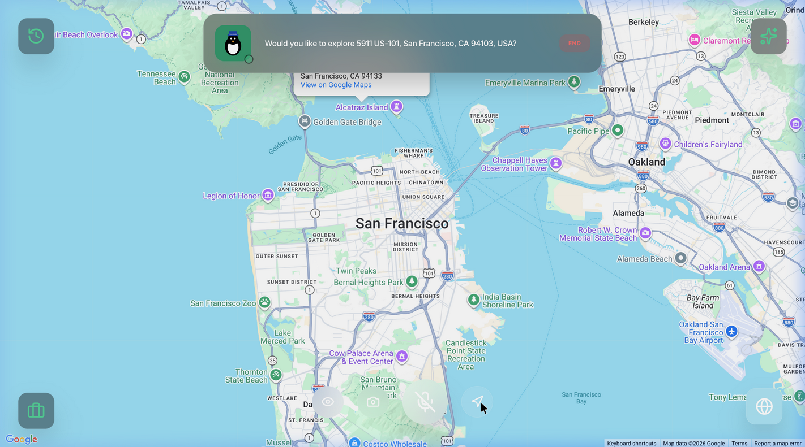

# CharlieTourGuide: Your Autonomous AI Companion


## Table of Contents
- [Inspiration](#inspiration)
- [How to Run (For Judges)](#how-to-run-for-judges)
- [What it does](#what-it-does)
- [Architecture & How we built it](#architecture--how-we-built-it)
- [Challenges & Accomplishments](#challenges--accomplishments)
- [What's next](#whats-next-for-charlietourguide)

## Inspiration
Imagine traveling the world, guided by an expert who knows the incredible history behind every brick, statue, and hidden alleyway. Traditional tour guides are fantastic, but they can be expensive, inflexible, and hard to book. Automated audio guides, on the other hand, are often static, boring, and unable to adapt to what you're actually looking at. 

We created **CharlieTourGuide** to democratize high-quality, deeply personal travel guidance. Our goal was to build a warm, charismatic, and interactive AI companion that doesn't just read facts from a script, but actually **sees** what you see, natively controls your exploration, and adapts dynamically to your interests. We want to make world-class travel exploration as simple as having a conversation.

---

## How to Run (For Judges)

We've made spinning up Charlie exceptionally easy, with two distinct ways to review our work:

### 1. The Deployed Version (Recommended)
You can directly test the final deployed application built specifically for this hackathon:
**Live URL:** [https://charlie-521515342281.us-central1.run.app](https://charlie-521515342281.us-central1.run.app)
*(Note: Please allow microphone access to talk to Charlie! Start by clicking the "Start" button.)*

### 2. Running Locally
If you want to view the source code and run the application locally on your machine, follow these simple steps:

1. **Clone the repository:**
   ```bash
   git clone <YOUR-GITHUB-REPO-URL-HERE>
   cd charlie_-the-gemini-live-tour-guide
   ```

2. **Install dependencies:**
   ```bash
   npm install
   ```

3. **Set up environment variables:**
   Since this app heavily relies on deeply-integrated Gemini capabilities, you need an API key. We have included an `.env.example` in the directory. Create an `.env` file:
   ```bash
   cp .env.example .env
   ```
   *Edit `.env` and fill in your `GEMINI_API_KEY` and `VITE_GOOGLE_MAPS_API_KEY` (with Directions API enabled).*

4. **Start the local React & Express server:**
   ```bash
   npm run dev
   ```
   *Navigate to `http://localhost:8080` in your Google Chrome browser.*


---

## What it does
Charlie is an autonomous, voice-first multimodal AI tour guide powered by **Gemini 2.5 Flash**. Represented by a friendly, animated penguin, Charlie creates fully customized, themed virtual tours (e.g., "Art Deco Chicago", "Cyberpunk Tokyo") right in your web browser. 

But Charlie isn't a passive assistant; **he takes the wheel**:
1. **Autonomous Navigation:** Charlie drives the experience. He pans the map, adjusts the zoom, switches to 3D mode, and dives into Street View without you ever touching the controls.
2. **Real-Time Multimodal Vision:** Charlie receives a live video feed of your screen. He uses Gemini's incredible vision capabilities to dynamically highlight specific buildings, signs, or architectural details using on-screen arrows, boxes, and text labels as he narrates.
3. **Interactive & Adaptive:** Charlie supports full-duplex conversations with barge-in capabilities. If you get bored, interrupt him to move on! If you ask a question about a specific building, he will focus on it and answer instantly.
4. **Actionable Itineraries:** Love the virtual tour? Charlie can instantly generate a detailed, real-world day-by-day travel itinerary complete with estimated travel costs, flight details, packing tips, and placeholder hotel bookings.

---

## Architecture & How we built it
To deliver a latency-free, cinematic tour experience, we orchestrated a highly responsive multimodal architecture:


### Technical Stack
- **Frontend (React, TypeScript, Tailwind):** We used the official `@vis.gl/react-google-maps` to achieve native rendering and deep control over the map's tilt, heading, and 3D terrain settings. Framer Motion drives the fluid, non-jarring UI animations, including the precise bounding-box highlights generated by Charlie.
- **Multimodal AI (Google GenAI SDK):** We deeply integrated the `@google/genai` Live API over WebSockets for full-duplex voice. By streaming base64 JPEGs of the UI elements to the model alongside the microphone data, we gave Charlie "eyes." 
- **Tool-Calling Engine:** The true magic relies on an extensive suite of JSON-defined functions (e.g., `update_map`, `highlight_on_screen`, `start_themed_tour`). The Gemini model autonomously strings these tools together to choreograph a seamless tour.


### Infrastructure
- **Backend & Deployment (Google Cloud Run & Firestore):** For scalability and security, we built a stateless Node.js endpoint deployed on **Google Cloud Run**, pulling environment variables at runtime. We migrated away from a local database to **Cloud Firestore** to safely store users' past locations and favorited landmarks.



---

## Challenges & Accomplishments

### Challenges we ran into
- **Autonomy vs. User Control:** Finding the right balance where the AI can commandeer the map's camera state (zoom, street view POV, tilt) without aggressively fighting the user's manual interactions required precise state management and debounce logic.
- **Visual Grounding:** Creating a reliable system for Charlie to accurately map his visual coordinates (what he "sees") to an absolute React frontend layout.
- **State Race Conditions:** Handling continuous, rapid-fire tool calls from Gemini Live over the WebSocket, such as ensuring route-drawing APIs didn't conflict with single-location map panning commands.

### Accomplishments that we're proud of
- **True Empathy & Charisma:** We successfully tuned the system instructions so that Charlie acts as a genuine leader—he proactively guides the user with a confident personality ("Follow me!", "Look at this structure!").
- **Flawless Multi-Agent Orchestration:** Integrating real-time audio chunking, video frame extraction, and complex map manipulation into a unified, crash-free interface.
- **Moving to Cloud-Native:** Executing a successful migration to Google Cloud infrastructure (Cloud Run & Firestore) just in time for the hackathon deployment, solving persistent API key exposure vulnerabilities.

---

## What's next for CharlieTourGuide
- **Augmented Reality (AR):** Integrating Charlie directly into smartphones so he can process your real-world camera feed while you walk down an actual street, projecting historical facts via AR overlays.
- **Multiplayer Tours:** Allowing friends in different cities to join the same synchronized virtual tour, experiencing Charlie's narration together.


